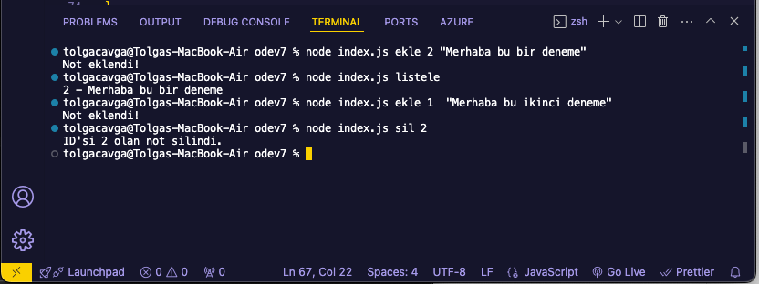

# Node.js Notlar Uygulaması
Bu proje, `Node.js`'in `fs` (dosya sistemi) modülünü kullanarak terminal üzerinden not ekleme, listeleme ve silme işlemleri yapmayı sağlar. Notlar `notlar.json` dosyasında saklanır ve her notun bir `ID`'si vardır.

---

## Amaç

Terminalden kullanıcı girdisi alarak:
- Yeni bir notu ID ile birlikte `notlar.json` içine ekler.
- Tüm notları terminalde listeler.
- Girilen ID'ye sahip bir notu siler.

---


## Çalıştırma Komutları:

📌 Yeni Not Ekleme:
node index.js ekle "Yeni bir not eklendi!"

📌 Tüm Notları Listeleme:
node index.js listele

📌 Belirli Bir Notu Silme (ID ile):
node index.js sil 2

📌 Beklenen Çıktı (Listeleme):
1 - Bu benim ilk Node.js dosyam!
2 - Merhaba, bu bir test mesajıdır!

📌 Not: "sil 2" komutu çalıştırıldığında ID'si 2 olan veri silinir ve dosyaya yeni hali kaydedilir.

---


## Ekran Çıktısı:




---

##  Kurulum

Node.js yüklü değilse [https://nodejs.org](https://nodejs.org) adresinden yükleyin.

Terminalde projenin bulunduğu klasöre girip aşağıdaki adımları izleyin:

```bash
# Proje klasörüne girin
cd proje-klasoru-adi

# index.js dosyasını oluşturun
touch index.js

# (Opsiyonel) package.json oluşturmak için
npm init -y
```
---

## **📌 Örnek Çalışma**  
**1️⃣ Yeni Not Ekleme**  
Komut:  
```bash
node index.js ekle "Bu benim ilk notum!"
```
JSON formatında kaydedilen veri (`notlar.json`):  
```json
[
  { "id": 1, "not": "Bu benim ilk notum!" }
]
```

**2️⃣ Yeni Not Eklediğimizde**  
Komut:  
```bash
node index.js ekle "İkinci not burada!"
```
JSON dosyası (`notlar.json`) güncellenir:  
```json
[
  { "id": 1, "not": "Bu benim ilk notum!" },
  { "id": 2, "not": "İkinci not burada!" }
]
```

**3️⃣ Notları Listeleme**  
Komut:  
```bash
node index.js listele
```
Beklenen Çıktı:  
```bash
1 - Bu benim ilk notum!
2 - İkinci not burada!
```

**4️⃣ Belirli Bir Notu Silme**  
Komut:  
```bash
node index.js sil 1
```
Eğer `1` ID’li not silinirse, yeni dosya şu şekilde olur:  
```json
[
  { "id": 2, "not": "İkinci not burada!" }
]
```

---

## **📌 Hata Yönetimi**  
Kodda **try/catch** yapısı kullanılarak hata yönetimi sağlanmıştır. Eğer `notlar.json` okunamazsa veya dosya yoksa otomatik olarak oluşturulur.  

---
